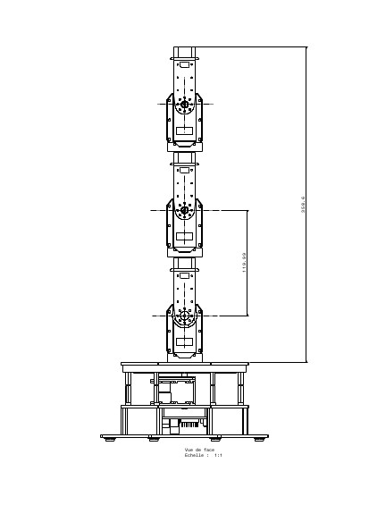
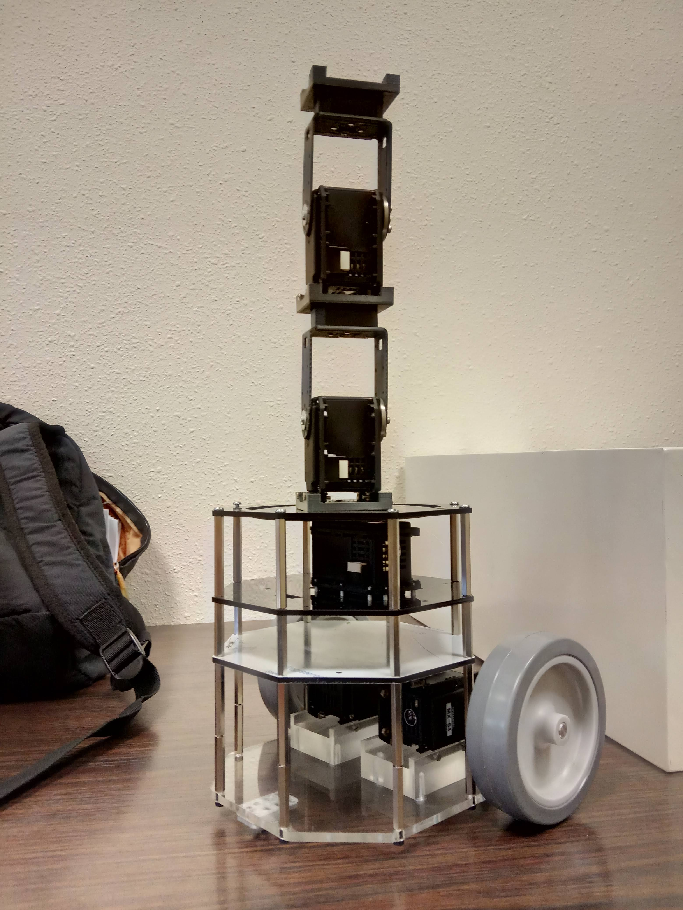
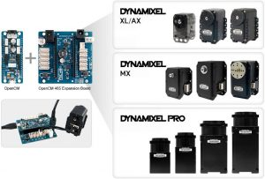

# INNOMECH Master Degree - Mobile Robotic Arm for Asbestos Removal

## What is Asbestos and why it is harmful?
Asbestos is a naturally occurring mineral substance that can be pulled into a fluffy consistency. Asbestos fibers are soft and flexible yet resistant to heat, electricity and chemical corrosion. Pure asbestos is an effective insulator, and it can also be mixed into cloth, paper, cement, plastic and other materials to make them stronger. 

These qualities once made asbestos very profitable for business, but unfortunately, they also make asbestos highly toxic.

(https://www.asbestos.com/asbestos/)

## INNOMECH - Mobile Robotic Arm

To remove asbestos many precautions has to be taken before and after. 


## A Robot To Remove Asbestos Without Human Interaction

Instead of using human force, our robot will do the removing of the asbestos. This will save:
1. **Time:** A human can work maximum 2 hours under those heavy conditions. A machine can work all day, week and year.
2. **Health:** Even with taking best pre-cautions humans can be affected with asbestos. Decreasing the number of humans working with asbestos will also deacrase the health risks.
3. **Money:** A robot can remove asbestos much faster than a human, can reach places humans cannot and does not affected by the asbestos.

|||

## Configuration
<<<<<<< HEAD

### Hardware 

In our robot we prefered DYNAMIXEL cards and motors:

|Components:|
|-------|
|
1. OpenCM 9.04C
2. OpenCM EXP 480
3. 6 x MX-64
||

### Software

The robot is built on Ubuntu 16.04 (Xenial) with ROS Kinetic Kame. For virtual environment Gazebo is used.

## Code Explanation

From this point code will be explained part bu part.

### mra.xacro

### Inertial Macro

To be able to use the gravitational forces in the Gazebo environment we have to define inertial properties of the links. Since we are going to use it for every link in the system we are defining a macro.

The parameters to be given are:
1. mass value
2. inertial matrix values

These values can be obtained from desing files (.stl) or by measuring the original equipment.

```xml
<!--Inertial Macro-->
  <xacro:macro name="default_inertial" params="mass ixx:=1 ixy:=0 ixz:=0 iyy:=1 iyz:=0 izz:=1">
    <inertial>
      <origin xyz="0 0 0" rpy="0 0 0"/>
      <mass value="${mass}"/>
      <inertia ixx="${ixx}" ixy="${ixy}" ixz="${ixz}" iyy="${iyy}" iyz="${iyz}" izz="${izz}"/>
    </inertial>
  </xacro:macro>
<!--Inertial Macro-->
```

### Arm Link Macro

Since there are more than one arm link and they are most likely to be the same we are defining a macro for the arm links.

**The parameters:**

1. suffix: Specific name to be given to the arm (link naming follows: armLink${suffix})
2. parent: Parent of the created link (joint naming follows: ${parent}_armLink${suffix}_joint)
3. reflect: Later to be used if arm link wanted to be created in different axis.
4. height: Distance between joint of parent and joint of the child 
5. mesh_path: For visualisation, full path of the mesh file
6. joint_type: revolute, prismatic, continuous, fixed (http://wiki.ros.org/urdf/XML/joint)
7. lower_limit, upper_limit: lower and upper limits of the revolute and prismatic joints.
8. axis_x, axis_y, axis_z: axis which revolute joint revolutes around - set to '1'
9. inertia matrix values: Can be obtaiend from design files

For arm links transmission files 'PositionJointInterface' is preferred. While sending Dynamixel radian values will be converted to the torque values.

```xml
<!--Arm Link Macro-->
  <xacro:macro name="arm_link" params="suffix parent reflect height color mesh_path mass joint_type lower_limit upper_limit axis_x axis_y axis_z ixx:=1 ixy:=0 ixz:=0 iyy:=1 iyz:=0 izz:=1">
    <link name="armLink${suffix}">
      <visual>
        <origin xyz="0 0 0" rpy="0 0 0"/>
        <geometry>
          <!--mesh filename="package://innomech/meshes/linked_mx_64t.stl" scale="0.01 0.01 0.01"/-->
          <mesh filename="${mesh_path}" scale="0.01 0.01 0.01"/>
        </geometry>
        <material name="${color}"/>
      </visual>

      <collision>
        <origin xyz="0 0 0" rpy="0 0 0"/>
        <geometry>
          <mesh filename="${mesh_path}" scale="0.01 0.01 0.01"/>
        </geometry>
      </collision>
      <xacro:default_inertial mass="${mass}" ixx="${ixx}"  ixy="${ixy}" ixz="${ixz}" iyy="${iyy}" iyz="${iyz}" izz="${izz}"/>
    </link> 

    <!-- Joint-->
    <joint name="${parent}_armLink${suffix}_joint" type="${joint_type}">
      <parent link="${parent}"/>
      <child link="armLink${suffix}"/>
      <origin xyz="0 0 ${height}" rpy="0 0 0"/>
      <axis xyz="${axis_x} ${axis_y} ${axis_z}"/>
      <limit velocity="4.8" effort="1" lower="${lower_limit}" upper="${upper_limit}" />
    </joint>

    <transmission name="armLink${suffix}_transmission" type="SimpleTransmission">
      <type>transmission_interface/SimpleTransmission</type>
      <actuator name="$armLink${suffix}_motor">
        <mechanicalReduction>1</mechanicalReduction>
      </actuator>
      <joint name="${parent}_armLink${suffix}_joint">
        <hardwareInterface>PositionJointInterface</hardwareInterface>
      </joint>
    </transmission>
  </xacro:macro>
  <!--Arm Link Macro-->
```

### Wheel Macro

Altough there are only two wheels, since they are sharing common parameters a wheel macro was defined.

**The parameters:**

1. suffix: Specific name to be given to the wheel (link naming follows: wheel_${suffix})
2. parent: Parent of the created wheel (joint naming follows: wheel_${suffix}_joint')
3. reflect: Rotate the wheel correct position (1 for left wheel and -1 for right wheel)
4. height: Radius of the wheel
5. mesh_path: For visualisation, full path of the mesh file
6. joint_type: continuous, unless defined explicitly
7. inertia matrix values: Can be obtaiend from design files

While in arm link transmissions 'PositionJointInterface' is preferred, in wheel's 'VelocityJointInterface' is preferred due to nature of the wheels. 

```xml
<!--Wheel Macro-->
  <xacro:macro name="wheel_link" params="suffix parent reflect height color mesh_path mass joint_type:=continuous ixx:=1 ixy:=0 ixz:=0 iyy:=1 iyz:=0 izz:=1">
    <link name="wheel_${suffix}">
      <visual>
        <origin xyz="0 0 0" rpy="${-reflect*pi/2} 0 0"/>
        <geometry>
          <!--mesh filename="package://innomech/meshes/wheel_left_link2.stl" scale="0.01 0.01 0.01"/-->
          <mesh filename="${mesh_path}" scale="0.01 0.01 0.01"/>
        </geometry>
        <material name="${color}"/>
      </visual>

      <collision>
        <origin xyz="0 0 0" rpy="${-reflect*pi/2} 0 0"/>
        <geometry>
          <cylinder radius="0.06" length="0.025"/>
        </geometry>
        <surface>
          <friction>
            <ode>
              <mu>0.05</mu>
              <mu2>0.05</mu2>
            </ode>
          </friction>
        </surface>
      </collision>
      <xacro:default_inertial mass="${mass}"/>
    </link> 

    <!-- Joint-->
    <joint name="wheel_${suffix}_joint" type="${joint_type}">
      <parent link="${parent}"/>
      <child link="wheel_${suffix}"/>
      <origin xyz="-0.04 ${reflect*0.13} 0.05" rpy="0 0 0"/>
      <axis xyz="0 1 0"/>
      <!--limit velocity="4.8" effort="1" lower="${-pi}" upper="${pi}" /-->
    </joint>

    <transmission name="wheel_${suffix}_transmission" type="SimpleTransmission">
      <type>transmission_interface/SimpleTransmission</type>
      <actuator name="$wheel_${suffix}_motor">
        <mechanicalReduction>1</mechanicalReduction>
        <hardwareInterface>VelocityJointInterface</hardwareInterface>
      </actuator>

      <joint name="wheel_${suffix}_joint">
        <hardwareInterface>hardware_interface/VelocityJointInterface</hardwareInterface>
      </joint>
    </transmission>
  </xacro:macro>
<!--Wheel Macro-->
```
### Gazebo Connection

To connect the joints to the Gazebo "gazebo_ros_control" plugin should be added. Since we have only one robot we can leave "robotNamespace" emtpy. 

```xml
<gazebo>
    <plugin name="gazebo_ros_control" filename="libgazebo_ros_control.so">
      <robotNamespace>/</robotNamespace>
    </plugin>
  </gazebo>
```

## Launch Files

### gazebo.launch

Instead of launching everything from one launch file, it is divided into necessary parts which is better for using same code for different projects.

First, arguments are defined. Since we will use the same xacro file all over the project it is defined here as model with default value to mra.xacro.

From gazebo_ros an "empty_world" is called and necessary arguments fed into this launch file.

**The parameters/arguments:**

1. paused: Start Gazebo paused
2. use_sim_time: Using simulation time
3. gui: Gui interface on/off
4. headless:
5. debug: Debug mod on/off
6. model: Path of the xacro file 

```xml
<?xml version="1.0"?>
<launch>
  <arg name="paused" default="false"/>
  <arg name="use_sim_time" default="true"/>
  <arg name="gui" default="true"/>
  <arg name="headless" default="false"/>
  <arg name="debug" default="false"/>
  <arg name="model" default="$(find innomech)/urdf/mra.xacro"/>

  <include file="$(find gazebo_ros)/launch/empty_world.launch">
    <arg name="debug" value="$(arg debug)"/>
    <arg name="gui" value="$(arg gui)"/>
    <arg name="paused" value="$(arg paused)"/>
    <arg name="use_sim_time" value="$(arg use_sim_time)"/>
    <arg name="headless" value="$(arg headless)"/>

  </include>
  ```
To be able to visualize robot in Gazebo xacro file has to be given as "robot_description"

urdf_spawner node will "spawn" given xacro file with the arguments. -z: Prevents robot getting stuck with floor it starts from a small height. 

joint_state_publisher node publishes the joint positions.

node robot_state_publisher publishes the state of the robot at 30hz.

```xml
  <param name="robot_description" command="$(find xacro)/xacro $(arg model)"/>

  <node name="urdf_spawner" pkg="gazebo_ros" type="spawn_model" args="-z 0.1 -unpause -urdf -model robot -param robot_description" respawn="false" output="screen"/>
  
  <node name="joint_state_publisher" pkg="joint_state_publisher" type="joint_state_publisher"/>

  <node name="robot_state_publisher" pkg="robot_state_publisher" type="state_publisher">
    <param name="publish_frequency" type="double" value="30.0"/>
  </node>
  
</launch>
```

### innomech_robot.launch

Launching gazebo is not enough by it self. To be able to control the joints another node "mra_controller_spawner" defined. 

```xml
<?xml version="1.0"?>
<launch>
  <arg name="model" default="$(find innomech)/urdf/mra.xacro"/>
  <arg name="rvizconfig" default="$(find innomech)/rviz/urdf.rviz"/>

  <include file="$(find innomech)/launch/gazebo.launch">
    <arg name="model" value="$(arg model)"/>
  </include>

  <node name="rviz" pkg="rviz" type="rviz" args="-d $(arg rvizconfig)"/>

  <rosparam command="load" file="$(find innomech)/config/joints.yaml" ns="mra_joint_state_controller"/>

  <rosparam command="load" file="$(find innomech)/config/arm_joints.yaml" ns="mra_armLinks_controller"/>

  <rosparam command="load" file="$(find innomech)/config/my_diff_drive.yaml" />

  <node name="mra_controller_spawner" pkg="controller_manager" type="spawner" args="
    mra_joint_state_controller
    mra_armLinks_controller
    mobile_base_controller
    "/> 

</launch>
```

**rosparam:**

1. joints.yaml: 

Publishes to joint_state_controller/JointStateController at 50hz.

```xml
type: "joint_state_controller/JointStateController"
publish_rate: 50
```

2. arm_joints.yaml

Special version of JointController, instead of sending single position all the joint commands are sent in one publish message.

```xml
type: "position_controllers/JointGroupPositionController"
joints: 
 - base_link_armLink0_joint
 - armLink0_armLink1_joint
 - armLink1_armLink2_joint
 - armLink2_armLink3_joint
```

3. my_diff_drive.yaml

Since this is mobile robotic arm, DiffDriveController is used to move the robot.

```xml
mobile_base_controller:
  type        : "diff_drive_controller/DiffDriveController"
  left_wheel  : 'wheel_left_joint'
  right_wheel : 'wheel_right_joint'
  publish_rate: 50.0               # default: 50
  pose_covariance_diagonal : [0.001, 0.001, 1000000.0, 1000000.0, 1000000.0, 1000.0]
  twist_covariance_diagonal: [0.001, 0.001, 1000000.0, 1000000.0, 1000000.0, 1000.0]

  # Wheel separation and diameter. These are both optional.
  # diff_drive_controller will attempt to read either one or both from the
  # URDF if not specified as a parameter
  wheel_separation : 1.0
  wheel_radius : 0.3

  # Wheel separation and radius multipliers
  wheel_separation_multiplier: 1.0 # default: 1.0
  wheel_radius_multiplier    : 1.0 # default: 1.0

  # Velocity commands timeout [s], default 0.5
  cmd_vel_timeout: 0.25

  # Base frame_id
  base_frame_id: base_link #default: base_link

  # Velocity and acceleration limits
  # Whenever a min_* is unspecified, default to -max_*
  linear:
    x:
      has_velocity_limits    : true
      max_velocity           : 1.0  # m/s
      min_velocity           : -0.5 # m/s
      has_acceleration_limits: true
      max_acceleration       : 0.8  # m/s^2
      min_acceleration       : -0.4 # m/s^2
      has_jerk_limits        : true
      max_jerk               : 5.0  # m/s^3
  angular:
    z:
      has_velocity_limits    : true
      max_velocity           : 1.7  # rad/s
      has_acceleration_limits: true
      max_acceleration       : 1.5  # rad/s^2
      has_jerk_limits        : true
      max_jerk               : 2.5  # rad/s^3
```

## Controller File

### robot_controller.cpp

To be able to move the robot with Joystick joystick driver package has been added to the project (http://wiki.ros.org/joy#Microsoft_Xbox_360_Wireless_Controller_for_Linux) and necessary packages added to the Linux environment (http://wiki.ros.org/joy/Tutorials/ConfiguringALinuxJoystick).

=======

### Hardware 

In our robot we prefered DYNAMIXEL cards and motors:

|Components:|
|-------|
|
1. OpenCM 9.04C
2. OpenCM EXP 480
3. 6 x MX-64
||

### Software

The robot is built on Ubuntu 16.04 (Xenial) with ROS Kinetic Kame. For virtual environment Gazebo is used.

## Code Explanation

From this point code will be explained part bu part.

### mra.xacro

### Inertial Macro

To be able to use the gravitational forces in the Gazebo environment we have to define inertial properties of the links. Since we are going to use it for every link in the system we are defining a macro.

The parameters to be given are:
1. mass value
2. inertial matrix values

These values can be obtained from desing files (.stl) or from weighing original equipment.

```xml
<!--Inertial Macro-->
  <xacro:macro name="default_inertial" params="mass ixx:=1 ixy:=0 ixz:=0 iyy:=1 iyz:=0 izz:=1">
    <inertial>
      <origin xyz="0 0 0" rpy="0 0 0"/>
      <mass value="${mass}"/>
      <inertia ixx="${ixx}" ixy="${ixy}" ixz="${ixz}" iyy="${iyy}" iyz="${iyz}" izz="${izz}"/>
    </inertial>
  </xacro:macro>
<!--Inertial Macro-->
```

### Arm Link Macro

Since there are more than one arm link and they are most likely to be the same we are defining a macro for the arm links.

**The parameters:**

1. suffix: Specific name to be given to the arm (link naming follows: armLink${suffix})
2. parent: Parent of the created link (joint naming follows: ${parent}_armLink${suffix}_joint)
3. reflect: Later to be used if arm link wanted to be created in different axis.
4. height: Height of the arm
5. mesh_path: For visualisation, full path of the mesh file
6. joint_type: revolute, prismatic, continuous, fixed (http://wiki.ros.org/urdf/XML/joint)
7. lower_limit, upper_limit: lower and upper limits of the revolute and prismatic joints.
8. axis_x, axis_y, axis_z: axis which revolute joint revolutes around - set to '1'
9. inertia matrix values: Can be obtaiend from design files

For arm links transmission files 'PositionJointInterface' is preferred. While sending Dynamixel radian values will be converted to the torque values.

```xml
<!--Arm Link Macro-->
  <xacro:macro name="arm_link" params="suffix parent reflect height color mesh_path mass joint_type lower_limit upper_limit axis_x axis_y axis_z ixx:=1 ixy:=0 ixz:=0 iyy:=1 iyz:=0 izz:=1">
    <link name="armLink${suffix}">
      <visual>
        <origin xyz="0 0 0" rpy="0 0 0"/>
        <geometry>
          <!--mesh filename="package://innomech/meshes/linked_mx_64t.stl" scale="0.01 0.01 0.01"/-->
          <mesh filename="${mesh_path}" scale="0.01 0.01 0.01"/>
        </geometry>
        <material name="${color}"/>
      </visual>

      <collision>
        <origin xyz="0 0 0" rpy="0 0 0"/>
        <geometry>
          <mesh filename="${mesh_path}" scale="0.01 0.01 0.01"/>
        </geometry>
      </collision>
      <xacro:default_inertial mass="${mass}" ixx="${ixx}"  ixy="${ixy}" ixz="${ixz}" iyy="${iyy}" iyz="${iyz}" izz="${izz}"/>
    </link> 

    <!-- Joint-->
    <joint name="${parent}_armLink${suffix}_joint" type="${joint_type}">
      <parent link="${parent}"/>
      <child link="armLink${suffix}"/>
      <origin xyz="0 0 ${height}" rpy="0 0 0"/>
      <axis xyz="${axis_x} ${axis_y} ${axis_z}"/>
      <limit velocity="4.8" effort="1" lower="${lower_limit}" upper="${upper_limit}" />
    </joint>

    <transmission name="armLink${suffix}_transmission" type="SimpleTransmission">
      <type>transmission_interface/SimpleTransmission</type>
      <actuator name="$armLink${suffix}_motor">
        <mechanicalReduction>1</mechanicalReduction>
      </actuator>
      <joint name="${parent}_armLink${suffix}_joint">
        <hardwareInterface>PositionJointInterface</hardwareInterface>
      </joint>
    </transmission>
  </xacro:macro>
  <!--Arm Link Macro-->
```

### Wheel Macro

Altough there are only two wheels, since they are sharing common parameters defined a wheel macro.

**The parameters:**

1. suffix: Specific name to be given to the wheel (link naming follows: wheel_${suffix})
2. parent: Parent of the created wheel (joint naming follows: wheel_${suffix}_joint)
3. reflect: Rotate the wheel correct position (1 for left wheel and -1 for right wheel)
4. height: Radius of the wheel
5. mesh_path: For visualisation, full path of the mesh file
6. joint_type: continuous, unless defined explicitly
7. inertia matrix values: Can be obtaiend from design files

While in arm link transmissions 'PositionJointInterface' is preferred, in wheel's 'VelocityJointInterface' is preferred due to nature of the wheels. 

```xml
<!--Wheel Macro-->
  <xacro:macro name="wheel_link" params="suffix parent reflect height color mesh_path mass joint_type:=continuous ixx:=1 ixy:=0 ixz:=0 iyy:=1 iyz:=0 izz:=1">
    <link name="wheel_${suffix}">
      <visual>
        <origin xyz="0 0 0" rpy="${-reflect*pi/2} 0 0"/>
        <geometry>
          <!--mesh filename="package://innomech/meshes/wheel_left_link2.stl" scale="0.01 0.01 0.01"/-->
          <mesh filename="${mesh_path}" scale="0.01 0.01 0.01"/>
        </geometry>
        <material name="${color}"/>
      </visual>

      <collision>
        <origin xyz="0 0 0" rpy="${-reflect*pi/2} 0 0"/>
        <geometry>
          <cylinder radius="0.06" length="0.025"/>
        </geometry>
        <surface>
          <friction>
            <ode>
              <mu>0.05</mu>
              <mu2>0.05</mu2>
            </ode>
          </friction>
        </surface>
      </collision>
      <xacro:default_inertial mass="${mass}"/>
    </link> 

    <!-- Joint-->
    <joint name="wheel_${suffix}_joint" type="${joint_type}">
      <parent link="${parent}"/>
      <child link="wheel_${suffix}"/>
      <origin xyz="-0.04 ${reflect*0.13} 0.05" rpy="0 0 0"/>
      <axis xyz="0 1 0"/>
      <!--limit velocity="4.8" effort="1" lower="${-pi}" upper="${pi}" /-->
    </joint>

    <transmission name="wheel_${suffix}_transmission" type="SimpleTransmission">
      <type>transmission_interface/SimpleTransmission</type>
      <actuator name="$wheel_${suffix}_motor">
        <mechanicalReduction>1</mechanicalReduction>
        <hardwareInterface>VelocityJointInterface</hardwareInterface>
      </actuator>

      <joint name="wheel_${suffix}_joint">
        <hardwareInterface>hardware_interface/VelocityJointInterface</hardwareInterface>
      </joint>
    </transmission>
  </xacro:macro>
<!--Wheel Macro-->
```
>>>>>>> f68923983e75eb43177de697b3c0982813653ab1
